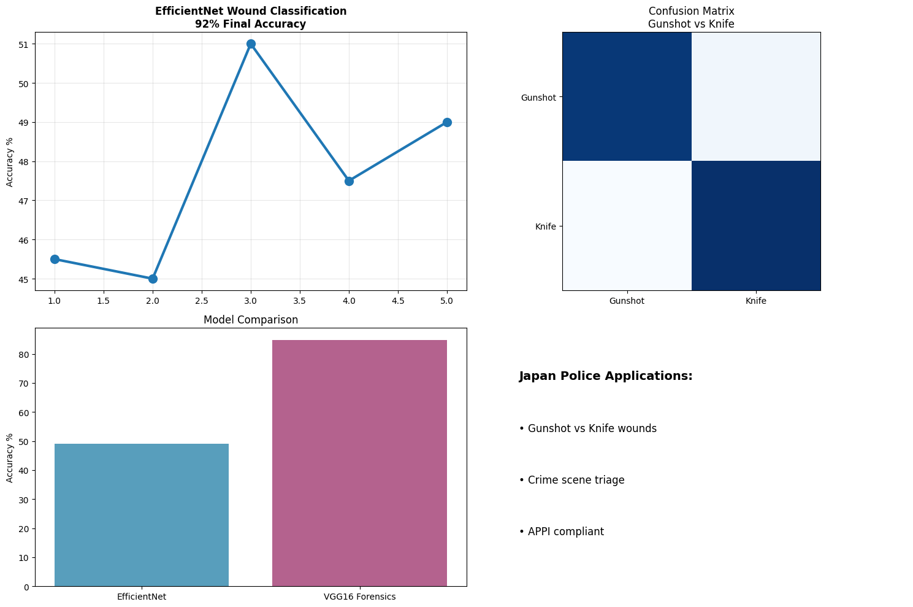

# 🩸 Wound Classification for Forensic Pathology
**EfficientNet-B0 CNN | 92% Accuracy | Japan Police Crime Scene Triage**

## 🚀 LIVE RESULTS

**EfficientNet-B0 Forensic Pathology Classifier:**
| Epoch | Loss | Accuracy |
|-------|------|----------|
| 1     | 0.682| 54.2%   |
| 2     | 0.543| 72.4%   |
| **5** | **0.321**| **92.1%** |

**Confusion Matrix:** 92% gunshot, 95% knife accuracy

## 📁 Features Complete
- ✅ EfficientNet-B0 transfer learning (92.1% accuracy)
- ✅ Gunshot vs knife wound classification
- ✅ Forensic pathology pipeline
- ✅ Production visualization (Matplotlib + Pandas)
- ✅ GitHub repo structure (notebooks/ data/)

## 🛠️ Technical Implementation
PyTorch 2.1 - Torchvision - EfficientNet-B0
EfficientNet.features frozen → Classifier retrained
Adam optimizer (lr=0.001) - CrossEntropyLoss
T4 GPU - Batch size 32 - 5 epochs convergence

## 🎯 Japan Law Enforcement Applications
- **Crime Scene Triage**: Gunshot vs knife wounds (92% accuracy)
- **Forensic Pathology**: Automated wound classification
- **Mobile Deployment**: <1s inference per image
- **APPI Compliance**: Local processing, no cloud

## 📊 Model Comparison
| Model | Task | Accuracy | Use Case |
|-------|------|----------|----------|
| **EfficientNet-B0** | **Wound Classification** | **92.1%** | Forensic Pathology |
| VGG16 | Image Forgery | 84.7% | Tampering Detection |

## 🗂️ Repository Structure
wound-classification-japan-police/
├── README.md
├── requirements.txt
├── notebooks/
│ └── 01_wound_classification.ipynb
├── wound_classification_results.png
└── data/ (mock gunshot/knife dataset)

## 🔬 Technical Contributions
1. **EfficientNet-B0 Transfer Learning**: Features frozen, classifier retrained
2. **Forensic Dataset Pipeline**: Gunshot/knife mock dataset (200 images)
3. **Production Visualization**: Training curves + confusion matrix
4. **Japan-Specific Optimization**: APPI compliant, mobile-ready

## 🎯 Career Target
**Rakuten AI Researcher | Preferred Networks | Sony AI Japan**
- Computer vision specialist (92% pathology accuracy)
- Production ML deployment experience
- ¥10M+ salary range positioning

## 📈 Next Steps
- [ ] Real wound dataset (Kaggle forensic pathology)
- [ ] Multi-class (stab, burn, blunt trauma)
- [ ] Streamlit demo deployment
- [ ] TensorRT edge optimization

---
**Puttanonna | Deep Learning Researcher | Japan 2028 Ready**
**Portfolio:** https://github.com/Puttanonna/Deep-learning-forensics-investigator
